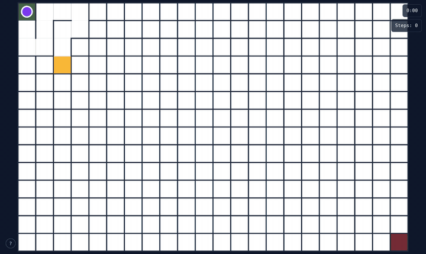
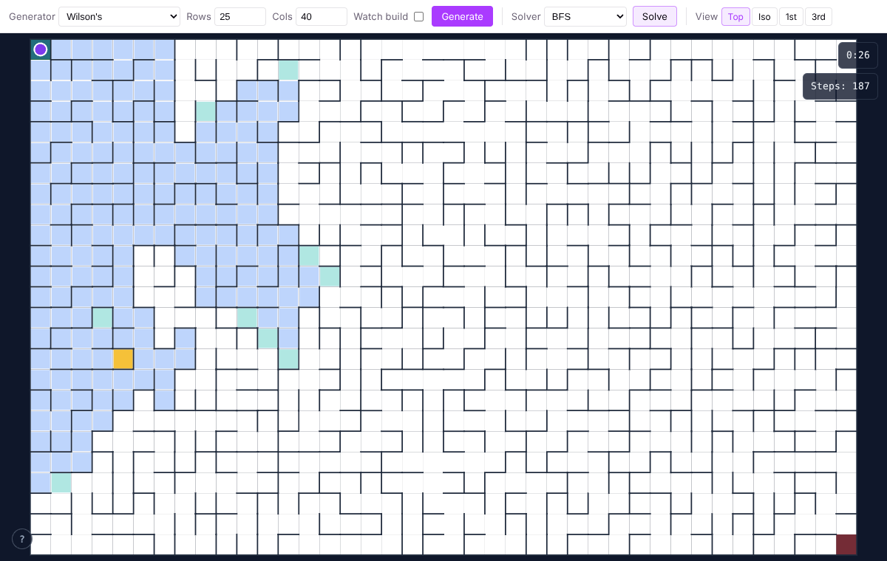
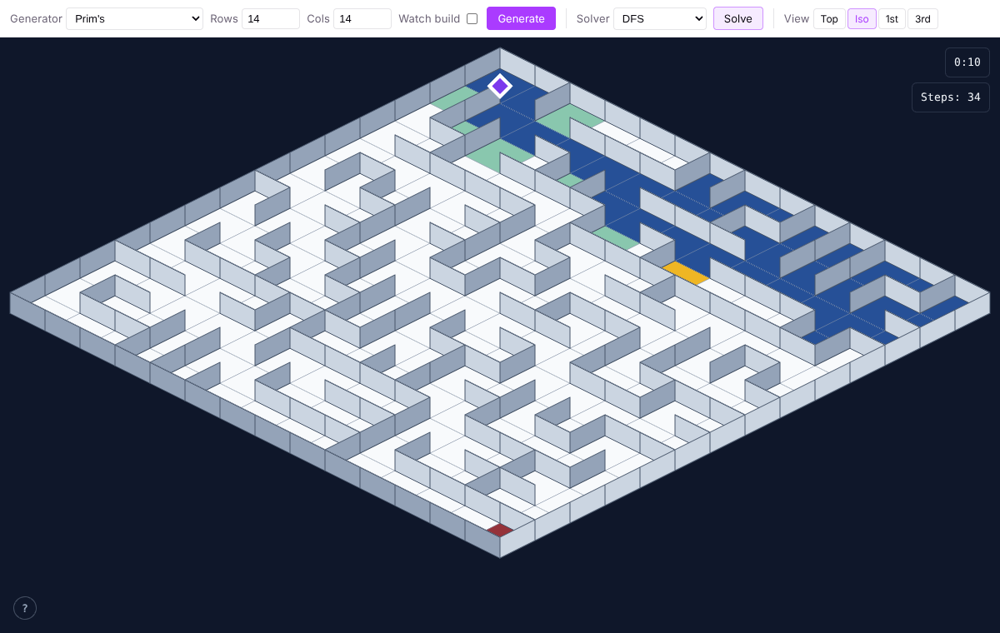
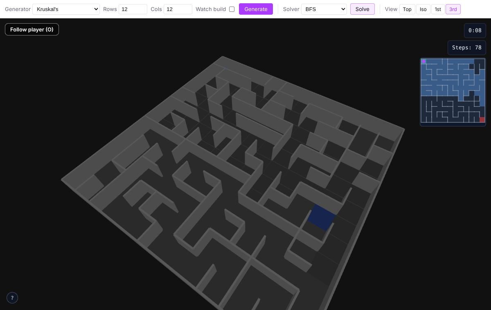
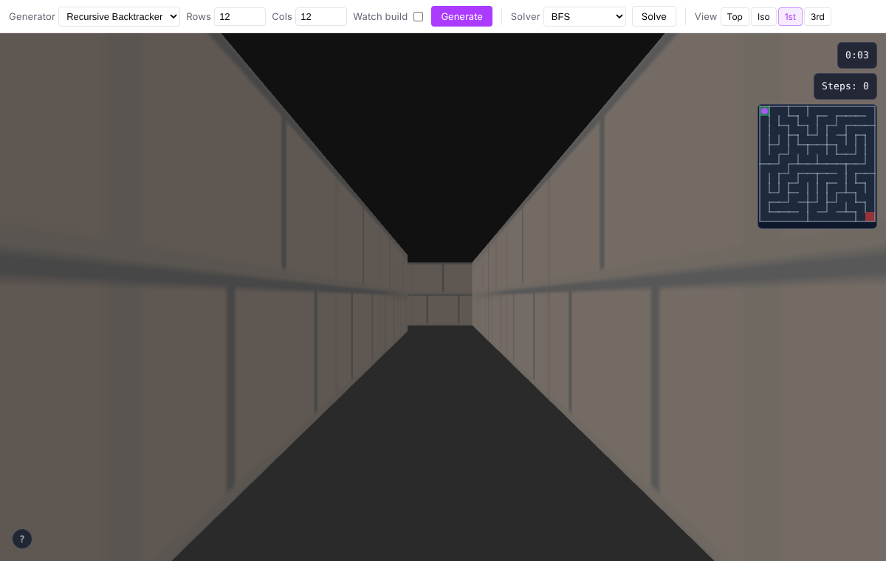
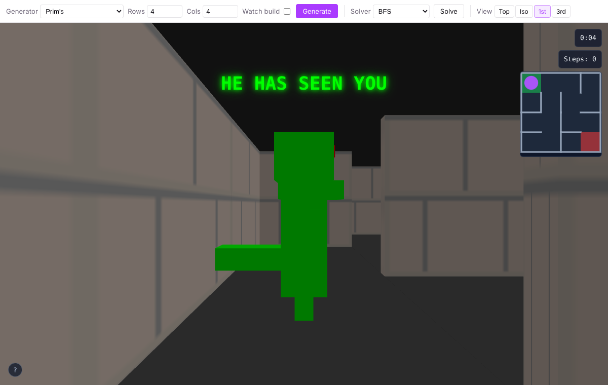

<div align="center">

# 🌀 MAZES

### _Carve it. Crack it. Walk it. Run from it._

**A pocket-sized labyrinth engine for your browser.** Watch a maze being carved one passage at a time, set a pathfinder loose on it, then drop into the corridors yourself, in flat 2D, crisp isometric, or full 3D where something green and very hungry is waiting.



`6 generators` · `4 solvers` · `4 ways to see it` · `1 T-Rex` · `installable PWA` · `works offline`

</div>

---

## ✨ What's in the box

|                                                                                             |                                                                                  |
| :-----------------------------------------------------------------------------------------: | :------------------------------------------------------------------------------: |
|         |       |
|      **Top-down.** The blueprint. BFS floods outward from the start like spilled ink.       | **Isometric.** A tiny tabletop diorama. DFS charges down one corridor at a time. |
|              |                             |
| **Third-person.** Orbit, zoom, pinch. Hit `O` to switch from god-view to over-the-shoulder. |     **First-person.** Brick walls, eye level, no map. Just you and the dark.     |

- 🧱 **Watch it build.** Every generator runs as a step-by-step animation, so you see the algorithm's personality as it carves.
- 🔍 **Watch it think.** Solvers paint their progress live: visited cells, the frontier, the current probe, and finally the golden path.
- 🕹️ **Play it yourself.** Arrow keys / WASD, or the on-screen d-pad on touch devices. Reach the red square to win.
- 🗺️ **HUD.** Timer, step counter, and a minimap that appears whenever you're down in the 3D corridors.
- 📱 **PWA.** Install it to your home screen and it keeps working offline.

---

## 🦖 Rex lies in wait



Step into **first-person** and you're not alone. Rex spawns at the exit and stalks you through the maze, pathfinding one cell closer every beat. The closer he gets, the louder the screen gets:

```
REX LIES IN WAIT
FOOTSTEPS APPROACHING
HE IS BESIDE YOU
RUN! HE IS BEHIND YOU
HE HAS SEEN YOU
```

Green phosphor text, a blocky dinosaur, a timer ticking. If that feels familiar, you've probably played a ZX81. Read on.

---

## 📜 A short history of getting lost

Mazes are one of the oldest puzzles we have, and computing has been chasing them almost since the first computers existed. This app is a love letter to that whole lineage.

**🏛️ Antiquity: the Labyrinth.** Greek myth has Daedalus building a labyrinth beneath Knossos to hold the Minotaur. Theseus got out with a ball of thread from Ariadne, which makes it the first recorded maze-solving algorithm: _remember where you've been_. (Strictly, most ancient labyrinths drawn on coins and floors are _unicursal_, a single winding path with no choices. The branching puzzle-maze came later.)

**🌳 1690s: hedges.** William III has a hedge maze planted at Hampton Court. It's still there, and people still get lost in it. The wall-follower trick, keeping one hand on the wall and never letting go, solves it. It works on any maze whose walls are all connected, which includes every maze this app generates.

**✏️ 19th century: Trémaux.** French engineer Charles Pierre Trémaux describes a pencil-and-chalk method for escaping any maze: mark passages as you walk them and never take one marked twice. It's depth-first search, long before anyone called it that.

**🐭 1950: Theseus the mouse.** Claude Shannon builds a mechanical mouse that learns its way through a reconfigurable 5×5 maze using relays under the floor. It's one of the first machines that _learns_, and it's named after the guy with the thread.

**🌲 1956–57: spanning trees.** Joseph Kruskal and Robert Prim publish their minimum-spanning-tree algorithms for networks. Feed them random weights and out falls a perfect maze, one where every cell connects to every other by exactly one path. (Vojtěch Jarník got to Prim's algorithm back in 1930.)

**🌊 1959–1961: the flood.** Edward F. Moore publishes breadth-first search as a way to find the shortest path out of a maze. Two years later C. Y. Lee uses the same flood-fill to route wires on circuit boards. Same algorithm, same ripple effect you see in the top-down screenshot.

**⭐ 1968: A\*.** Peter Hart, Nils Nilsson and Bertram Raphael at SRI need Shakey the robot to plan routes, so they invent A\*: BFS with a sense of direction. It's still what most game characters use to find you.

**🕹️ 1973: Maze War.** At NASA Ames, Steve Colley, Greg Thompson and Howard Palmer write _Maze War_, where eyeballs hunt each other through wireframe corridors. It's widely cited as the first first-person shooter. Gaming's first-person perspective was born inside a maze.

**🦖 1981: 3D Monster Maze.** Malcolm Evans squeezes a fully 3D maze _and_ a Tyrannosaurus rex into a Sinclair ZX81 with 16K of RAM. Rex hunts you while the screen narrates your doom: _"REX LIES IN WAIT"… "RUN HE IS BEHIND YOU"_. It's often called the first 3D game on a home computer and one of the first survival-horror games. **This app's first-person mode is a direct homage.**

**🧮 1982: Eller.** Marlin Eller finds a way to build a perfect maze _one row at a time_ with memory proportional to the width, so in principle you could generate an infinitely tall maze.

**🎲 1989–1996: true randomness.** Aldous and Broder show that a plain random walk, carving whenever it steps somewhere new, produces a _uniformly_ random spanning tree: every possible maze equally likely. In 1996 David Wilson speeds that up with loop-erased random walks. Both are in here, and you can watch both wander.

---

## 🧱 Generators

Every generator produces a **perfect maze**: no loops, no unreachable pockets, exactly one route between any two cells. They just disagree, loudly, about what that route should _feel_ like.

| Algorithm                 | Personality                                                                                     |
| ------------------------- | ----------------------------------------------------------------------------------------------- |
| **Recursive Backtracker** | The long-distance runner. Deep, twisting rivers and very long solutions. Great for 3D dread.    |
| **Prim's**                | The coral reef. Grows outward from one seed, lots of short dead ends, very "branchy".           |
| **Kruskal's**             | The archipelago. Random islands of passage that merge until there's one continent.              |
| **Wilson's**              | The perfectly fair one. Unbiased, uniformly random mazes via loop-erased random walks.          |
| **Aldous-Broder**         | The drunkard's walk. Also perfectly unbiased, and gloriously slow to finish the last few cells. |
| **Eller's**               | The typewriter. Builds row by row, top to bottom, merging sets as it goes.                      |

## 🔍 Solvers

| Solver            | How it hunts                                                                      | Shortest path? |
| ----------------- | --------------------------------------------------------------------------------- | :------------: |
| **BFS**           | A ripple in a pond: explores everything at distance 1, then 2, then 3…            |       ✅       |
| **DFS**           | Trémaux's chalk: commit to a corridor, back out only when it dead-ends.           |       ➖       |
| **A\***           | BFS with a compass: always expands the cell that _looks_ closest to the exit.     |       ✅       |
| **Wall Follower** | Right hand on the wall, never let go. Ancient, dumb, and guaranteed to work here. |       ➖       |

(In a perfect maze there's only one route, so every solver ends on the same golden path. What differs is how much of the maze they have to search to find it, which is the fun part to watch.)

---

## 🎮 Controls

| Input                | Top-down / Isometric / Third-person           | First-person     |
| -------------------- | --------------------------------------------- | ---------------- |
| `↑` `W`              | Move north                                    | Step forward     |
| `↓` `S`              | Move south                                    | Step back        |
| `←` `A`              | Move west                                     | Turn left        |
| `→` `D`              | Move east                                     | Turn right       |
| `O`                  | Overview / follow camera (3rd only)           | —                |
| Drag · wheel · pinch | Orbit & zoom (3rd) · pinch to zoom & pan (2D) | —                |
| Touch d-pad          | Shown automatically on touch devices          | Turn-based d-pad |

Hit **`?`** in the corner for an on-screen cheat sheet that follows whichever view you're in.

---

## 🚀 Run it

```bash
npm install
npm run dev          # Vite dev server at http://localhost:5173
```

```bash
npm run build        # Type-check + production build (with service worker)
npm run preview      # Serve the production build
npm run test:run     # Vitest unit tests
npm run test:e2e     # Playwright end-to-end + visual tests
npm run lint         # ESLint
npm run knip         # Hunt for dead code
```

### Under the hood

- **Vite + TypeScript** with no UI framework, just DOM and canvas.
- **Canvas 2D** for the top-down and isometric views (painter's-algorithm iso projection).
- **Three.js** for first- and third-person: procedurally generated brick textures, lerped camera moves, an orbit/follow chase cam.
- **Generators & solvers are JS generators** (`function*`). Each `yield` is one animation frame, which is why every algorithm can be watched step by step for free.
- **vite-plugin-pwa / Workbox** for install + offline.
- **Vitest + jsdom** for unit tests, **Playwright** for e2e and visual regression.

```
src/
├── generators/   six maze carvers, each a step-yielding generator
├── solvers/      BFS · DFS · A* · wall follower + the animation loop
├── views/        top-down, isometric, first-person, third-person
├── three/        Three.js scene, geometry & materials
├── ui/           toolbar, HUD + minimap, keyboard hints
├── rex.ts        🦖
└── main.ts       wiring it all together
```

---

<div align="center">

_Theseus had a ball of thread. You have a golden path, a minimap, and a head start._

**Don't let him catch you.**

MIT © Chris Brooksbank

</div>
